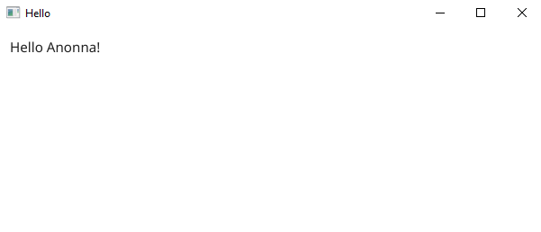
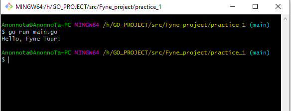
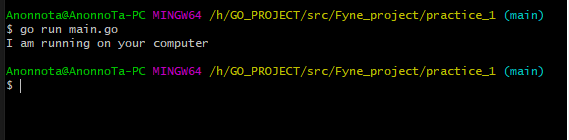
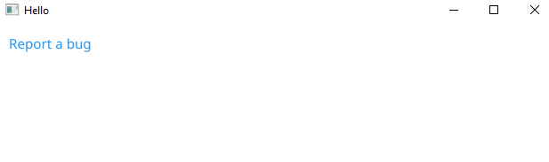
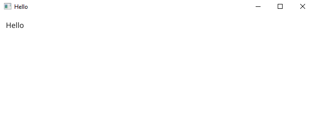

## GUI Overview

``` go
package main

import (
	"fyne.io/fyne/v2/app"
	"fyne.io/fyne/v2/widget"
)

func main() {
	app := app.New()

	w := app.NewWindow("Hello")
	w.SetContent(widget.NewLabel("Hello Anonna!"))

	w.ShowAndRun()
}
```
### output :



## Programming with Go
``` go 
package main

import "fmt"

func main() {
	fmt.Println("Hello, Fyne Tour!")
}
```
### Output


## Building Code Samples
``` go
package main

import "fmt"

func main() {
	fmt.Println("I am running on your computer")
}
```
### output


## Organisation and Packages

``` go
package main

import (
	"fyne.io/fyne/v2"
	"fyne.io/fyne/v2/app"
	"fyne.io/fyne/v2/canvas"
	"fyne.io/fyne/v2/container"
	"fyne.io/fyne/v2/data/binding"
	"fyne.io/fyne/v2/data/validation"
	"fyne.io/fyne/v2/dialog"
	"fyne.io/fyne/v2/layout"
	"fyne.io/fyne/v2/storage"
	"fyne.io/fyne/v2/storage/repository"
	"fyne.io/fyne/v2/test"
	"fyne.io/fyne/v2/theme"
	"fyne.io/fyne/v2/widget"
)

func main() {
}
```

## Packaging and Distribution
``` go
#!/bin/sh

go get fyne.io/fyne/v2/cmd/fyne

go build
fyne package -icon mylogo.png

# result is a platform specific package
# for the current operating system.
```
## Beginner to Expert
``` go
package main

import (
	"net/url"

	"fyne.io/fyne/v2/app"
	"fyne.io/fyne/v2/widget"
)

func main() {
	myApp := app.New()
	myWindow := myApp.NewWindow("Hello")

	bugURL, _ := url.Parse("https://github.com/fyne-io/fyne/issues/new")
	myWindow.SetContent(widget.NewHyperlink("Report a bug", bugURL))

	myWindow.ShowAndRun()
}
```
### output


## Application and RunLoop
``` go 
package main

import (
	"fmt"

	"fyne.io/fyne/v2/app"
	"fyne.io/fyne/v2/widget"
)

func main() {
	myApp := app.New()
	myWindow := myApp.NewWindow("Hello")
	myWindow.SetContent(widget.NewLabel("Hello"))

	myWindow.Show()
	myApp.Run()
	tidyUp()
}

func tidyUp() {
	fmt.Println("Exited")
}
```
### output

